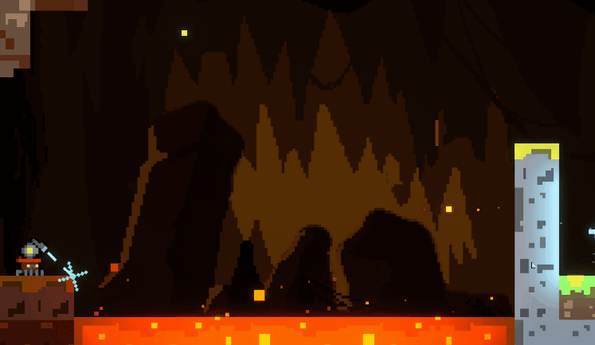

<p align="center">
  
</p>

<!--
```text
 ____  ______   __ _    _   _   _____  _    _   _
| __ )|  _ \ \ / // \  | \ | | |_   _|/ \  | \ | |
|  _ \| |_) \ V // _ \ |  \| |   | | / _ \ |  \| |
| |_) |  _ < | |/ ___ \| |\  |   | |/ ___ \| |\  |
|____/|_| \_\|_/_/   \_\_| \_|   |_/_/   \_\_| \_|
```
-->

Hi, I'm a game developer who mainly programs in C++. I love games. :)

Right now I mostly work on the SD game engine at school. On the side, I make all sorts of small helper tools.

[**SD-Engine**](https://github.com/bryanT4N/SD-Engine) — my C++ game engine. It handles rendering, math & physics, events, input, audio, and UI. I'm still improving the engine, and I'm building two new games on it.

[**NetChess3D**](https://github.com/bryanT4N/SD-Engine/tree/main/NetChess3D) — a 3D chess game. I'm mainly working on its rendering and adding networking.

[**AceAttorneyApproximation**](https://github.com/bryanT4N/SD-Engine/tree/main/AceAttorneyApproximation) — an Ace Attorney style adventure game. I'm mainly working on its UI and dialogue system.
